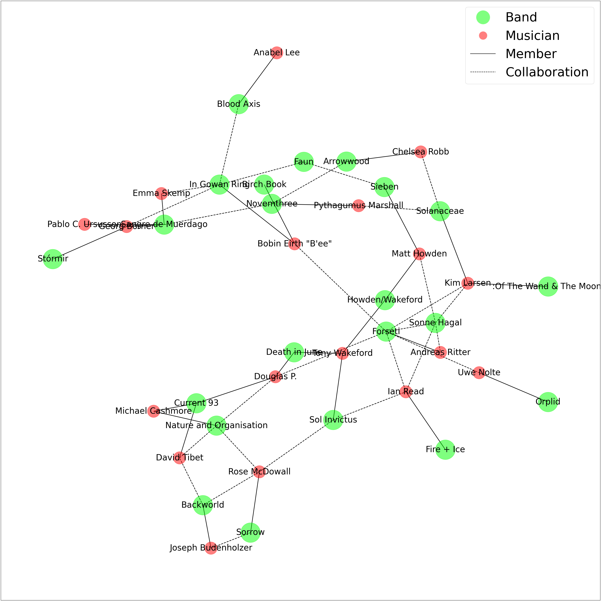
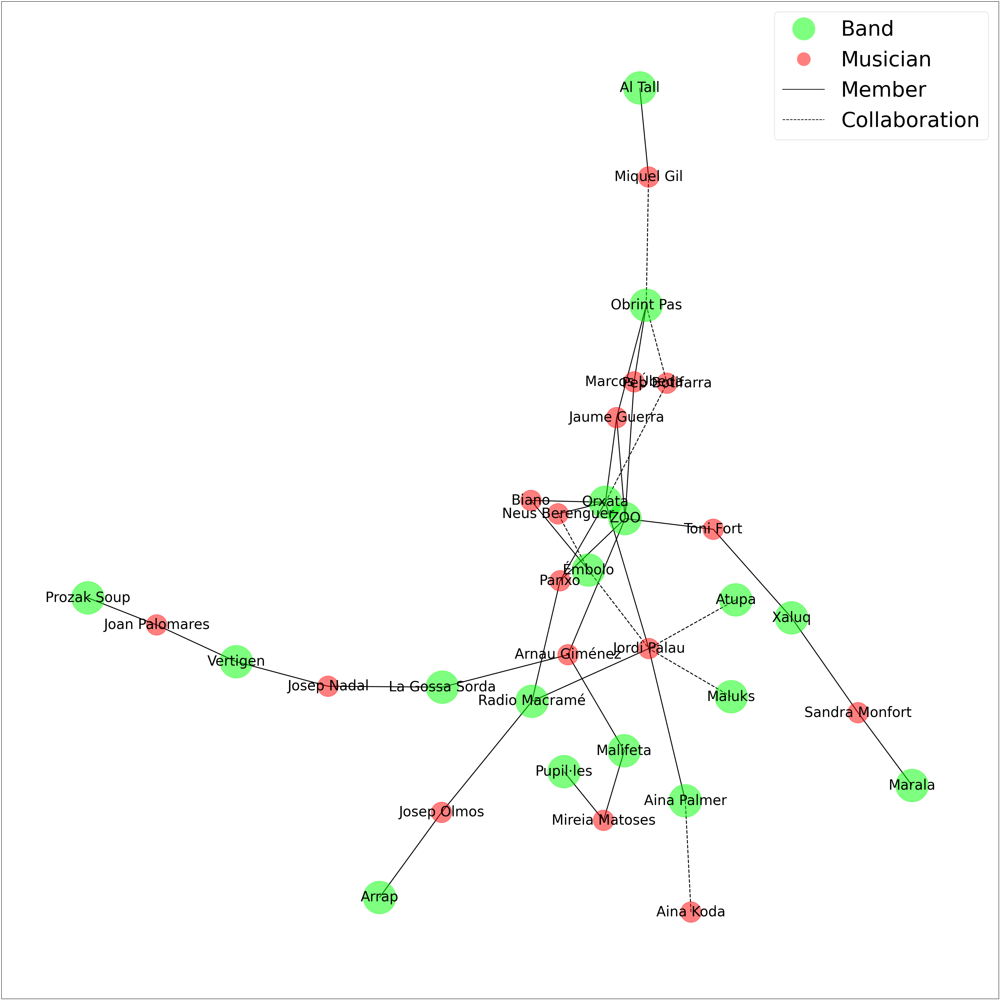
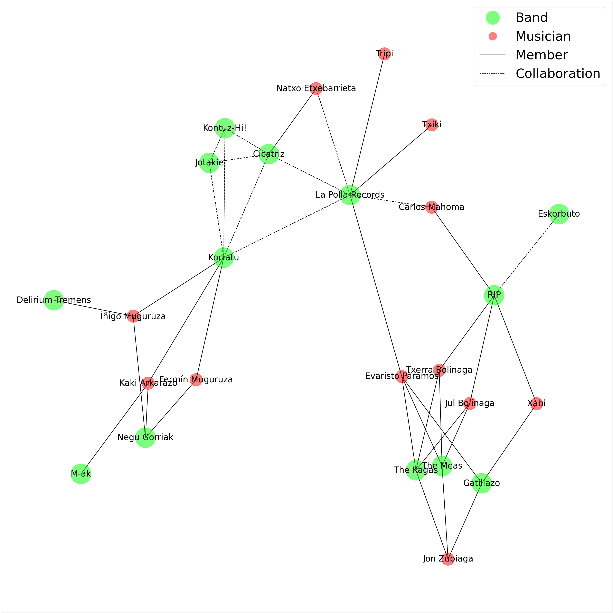
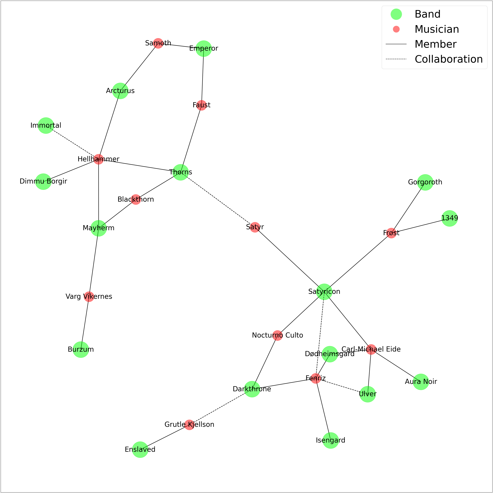
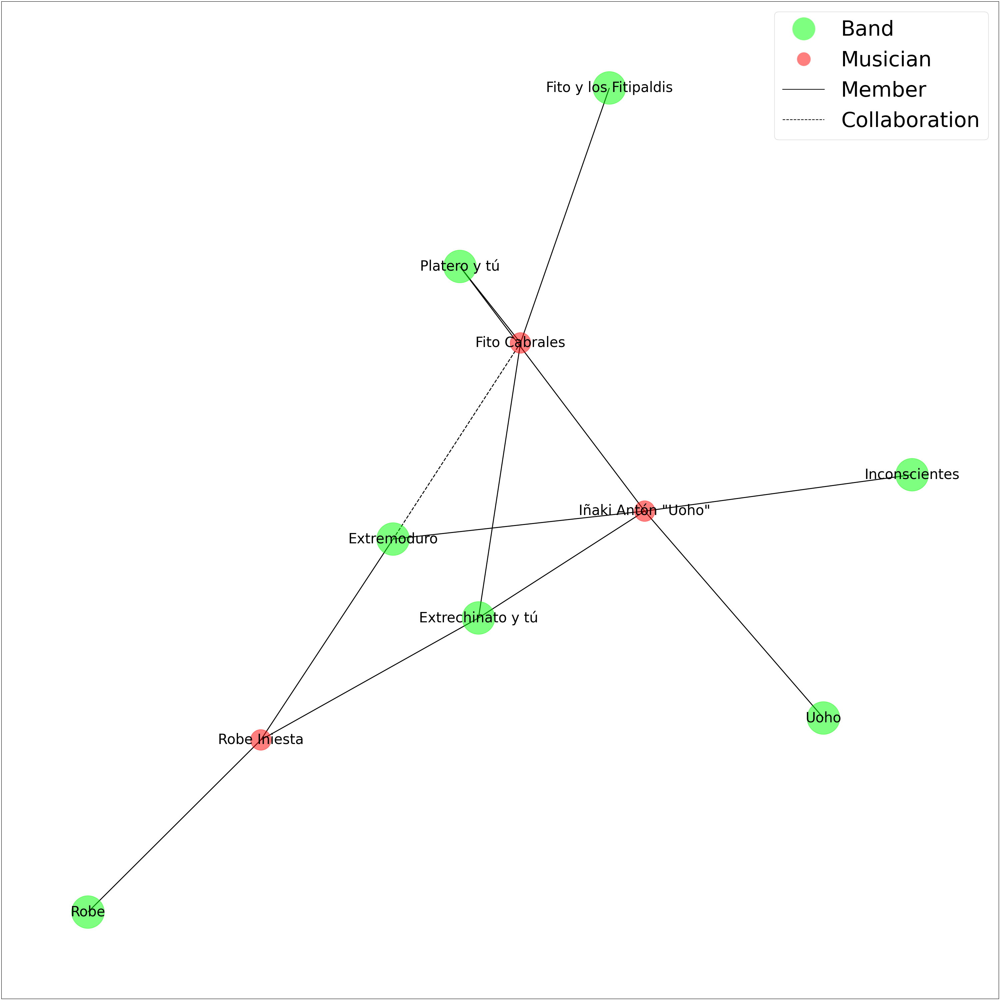

# XarxaMusical

---

## Description

Given a list of bands belonging to a musical movement, create a graph of memberships and collaborations using [Networkx](https://networkx.org/).

Data is stored in folder `data` and are text files with several rows, wach of them with the following format: `band;members;collaborations`. `members` and `collaborations` are lists of musicians or bands separated by commas `,`. `collaborations` includes collaborations between bands and musicians from other projects, and also between bands in songs or split albums.

---

## Examples

Here are some examples of musical movements, showing the relations between bands. Most of info has been extracted from [Wikipedia](https://en.wikipedia.org), [Discogs](https://www.discogs.com/), [Rate Your Music](https://rateyourmusic.com/) and other sources.

- [Neofolk](https://en.wikipedia.org/wiki/Neofolk) bands

- [Valencian](https://en.wikipedia.org/wiki/Valencian_Community) musical scene

- [Basque Radical Rock](https://en.wikipedia.org/wiki/Basque_Radical_Rock)

- [Norwegian Black Metal](https://en.wikipedia.org/wiki/Early_Norwegian_black_metal_scene)

- Collaboration network of [Extremoduro](https://en.wikipedia.org/wiki/Extremoduro) and related bands

---

## To do

- Improve graph visualization, maybe use Graphviz
- Reorganize as a class
- Include further musical scenes

## Contact

If you want to include new data or have comments or suggestions, Feel free to create a pull request or contact me at <pablo.villanueva.domingo@gmail.com>.